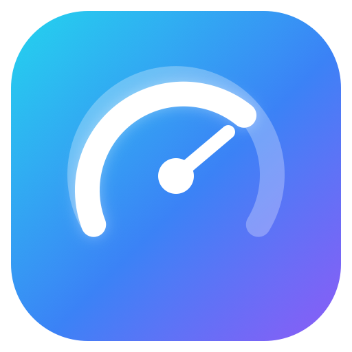
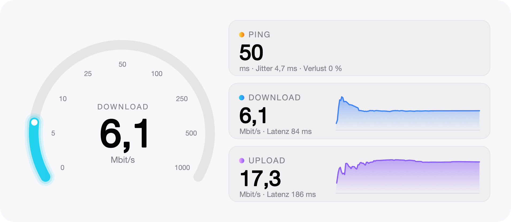

<div align="center">



# Speedtest Live für Tinycast

**Ping, Download und Upload live – mit Tacho, Verlaufskurven und flüssiger Anzeige.**

<picture>
  <source media="(prefers-color-scheme: dark)" srcset="docs/dashboard-dunkel.png">
  
</picture>

</div>

## Warum

[Tinycast](https://github.com/abue-ammar/tinycast) führt Raycast-Erweiterungen nativ aus, reicht die
Ausgabe von `child_process.spawn` aber erst nach Prozessende weiter. Speedtest-Erweiterungen zeigen
deshalb eine halbe Minute lang nichts und am Ende nur das Ergebnis.

Speedtest Live umgeht das: Die Ookla-CLI schreibt ihre Messwerte in eine Datei, die Erweiterung liest
sie zehnmal pro Sekunde und zeichnet daraus das Dashboard. Zeiger, Zahlen und Kurven gleiten dabei zu
jedem neuen Messpunkt, statt zu springen.

## Funktionen

- **Tacho** mit speedtest.net-Skala von 0 bis 1000 Mbit/s für die laufende Phase
- **Kacheln** für Ping, Download und Upload; die aktive Phase ist hervorgehoben
- **Verlaufskurven**, die mit dem Fortschritt wachsen und zugleich Fortschrittsbalken sind
- **Details** zu Jitter, Paketverlust und Latenz unter Last
- **Server, Ort und Anbieter** unter dem Dashboard, mit Hinweis bei VPN-Verbindung
- **Letztes Ergebnis** als Untertitel des Befehls im Launcher
- Helles und dunkles Erscheinungsbild

## Voraussetzungen

- [Tinycast](https://github.com/abue-ammar/tinycast), getestet mit 0.11.3
- Ookla Speedtest CLI:

  ```bash
  brew install teamookla/speedtest/speedtest
  ```

- Für die Installation aus diesem Repository: Node.js und ein Paketmanager (pnpm, Bun, Yarn oder npm).
  Tinycast baut die Erweiterung dabei aus dem Quellcode.

## Installation

### Über die Tinycast-Einstellungen

1. **Einstellungen → Extensions → Install** öffnen.
2. Unter **Registries** das Repository `llabusch93/tinycast-speedtest-live` hinzufügen.
3. Unter **Search Registries** nach „speedtest“ suchen und **Speedtest Live** installieren.

### Aus einem lokalen Ordner

```bash
git clone https://github.com/llabusch93/tinycast-speedtest-live.git
cd tinycast-speedtest-live/extensions/speedtest-live
npm install
npm run build
```

Danach in Tinycast **Einstellungen → Extensions → Install → Add from folder** wählen und den Ordner
`extensions/speedtest-live/dist` angeben.

## Bedienung

Im Launcher **Speedtest** aufrufen; die Messung startet sofort.

| Taste | Aktion |
| --- | --- |
| <kbd>↩</kbd> oder <kbd>⌘</kbd> <kbd>R</kbd> | Messung neu starten |
| <kbd>⌘</kbd> <kbd>⇧</kbd> <kbd>C</kbd> | Ergebnis als Text kopieren |
| <kbd>⌘</kbd> <kbd>K</kbd> | Weitere Aktionen, z. B. Ergebnis auf speedtest.net öffnen |
| <kbd>esc</kbd> | Schließen; eine laufende Messung wird abgebrochen |

## So funktioniert es

- Die CLI läuft mit `--format=jsonl --progress=yes` und schreibt etwa neun Messpunkte pro Sekunde
  in eine Datei im Support-Ordner der Erweiterung. Nach dem Lauf wird die Datei gelöscht.
- Das Dashboard ist ein SVG in einer einzelnen Grid-Kachel. Anders als ein Bild im Markdown behält eine
  Grid-Kachel in Tinycast ihr letztes Bild, bis das nächste fertig ist. So blinkt nichts beim Wechsel.
- Die Anzeige wird etwa 15-mal pro Sekunde neu gezeichnet und gleitet mit einer Zeitkonstante von
  rund 150 ms zum jeweils neuesten Messwert. Die Bildrate stellst du über `FRAME_MS` in
  [`src/dashboard.ts`](extensions/speedtest-live/src/dashboard.ts) ein.
- Das SVG verzichtet auf Weichzeichner: Der Schein am Tacho besteht aus zwei blassen, breiten Strichen.
  Das ist beim Zeichnen etwa viermal günstiger.

## Entwicklung

```bash
cd extensions/speedtest-live
npm install
npm test         # prüft Parsen und Gleiten an einem aufgezeichneten Messlauf
npm run build    # baut nach dist/
```

`npm test -- <ordner>` schreibt zusätzlich die SVG-Zwischenstände (Verbinden, Ping, Download, Upload,
Fertig, Fehler) in den angegebenen Ordner.

## Hinweise

- Beim Start übergibt die Erweiterung `--accept-license --accept-gdpr` an die Ookla-CLI. Mit jeder
  Messung akzeptierst du damit die [Lizenz](https://www.speedtest.net/about/eula) und die
  [Datenschutzerklärung](https://www.speedtest.net/about/privacy) von Ookla.
- Kein offizielles Produkt von Ookla, Raycast oder Tinycast. Speedtest® ist eine Marke von Ookla.

## Lizenz

[MIT](LICENSE)
